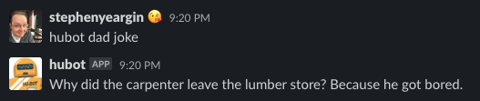

# Dad Jokes

[](http://badge.fury.io/js/hubot-dad-jokes) [](https://travis-ci.com/stephenyeargin/hubot-dad-jokes)

Load a dad joke from [fatherhood.gov](https://fatherhood.gov/).



## Installation

In hubot project repo, run:

`npm install hubot-dad-jokes --save`

Then add **hubot-dad-jokes** to your `external-scripts.json`:

```json
[
  "hubot-dad-jokes"
]
```

## Sample Interaction

```
user1>> hubot dadjoke
hubot>> Did you hear the one about the Ballerina Debate Team? They always stay on point.
```

## NPM Module

https://www.npmjs.com/package/hubot-dad-jokes
